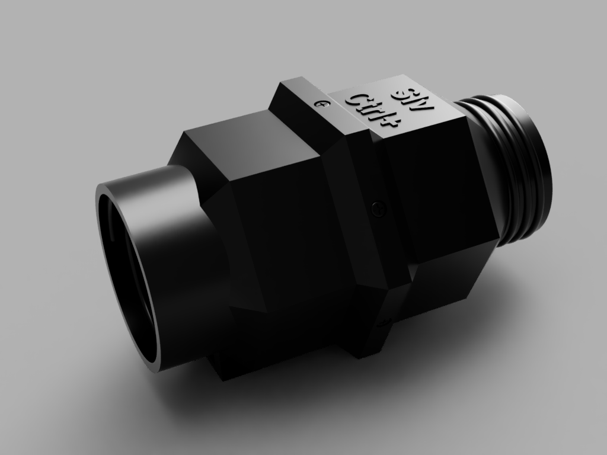

# slvctrl-airvalve

## Printing
The files can be found in the [stl/](./stl) folder of this repository.

### Material
Good results were achieved using ABS and PETG. PLA was not tested, but may also work out fine. 
For the ValvePlate_TPU.stl a flexible material like TPU is a must to ensure a good seal

### Perimeters
A minimum of three (3) are recommended for stability, but less can work out fine as well (your mileage may vary)

### Infill
30%  with Grid, Triangles or Cubic is recommended.

### Supports
The slvCtrl-airvalve was designed to be printed with minimal need for supports. 
Refer to the picture for placement on the build plate. Only the ValveBox_Rear.stl requires a support under the USB-Port

## BOM
* 1x SG90 micro servo 9g
* 1x Adafruit Trinket M0
* 20x M2x8 self-tapping screws

## Construction
Combine the components adding screws where necessary. Consult the image for reference.
The servo cable will have to be cut and shortened, then fed through the hole in the ValveBox_RearTrinketMount.stl 
and then soldered to the trinket connections.
